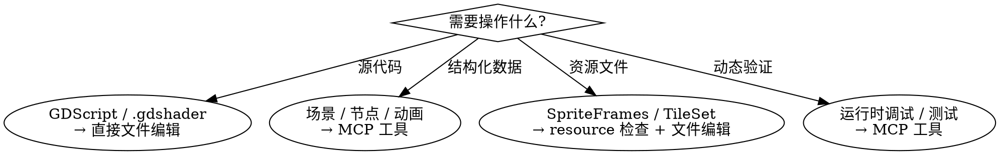

# Godot MCP

## Overview

Godot MCP 提供与 Godot 编辑器的实时交互能力。核心原则：**运行时状态用 MCP，源代码用文件编辑**。

## When to Use



## MCP vs File Editing

| 操作类型 | 推荐方式 | 原因 |
|---------|---------|------|
| GDScript (.gd) | 文件编辑 | 纯文本，直接编辑安全 |
| Shader (.gdshader) | 文件编辑 | 纯文本，直接编辑安全 |
| 场景结构 (.tscn) | **MCP** | 复杂格式，易损坏 |
| 节点属性 | **MCP** | 运行时状态，需编辑器同步 |
| AnimationPlayer | **MCP** | 结构复杂，支持播放控制 |
| TileMapLayer/GridMap | **MCP** | 坐标系统复杂 |
| SpriteFrames (.tres) | resource 检查 + 文件编辑 | MCP 只读，需手动编辑 |
| project.godot | 文件编辑（已知键名）或 MCP | 均可 |

## Tool Quick Reference

| 工具 | 用途 |
|------|------|
| `launch_editor` | 启动 Godot 编辑器打开项目 |
| `run_project` | 运行项目（F5 等效），返回调试输出 |
| `get_debug_output` | 获取当前运行时输出和错误 |
| `stop_project` | 停止运行中的项目 |
| `get_godot_version` | 获取 Godot 版本 |
| `list_projects` | 列出目录中的 Godot 项目 |
| `get_project_info` | 项目元信息（场景/脚本/资源数量） |
| `create_scene` | 创建新场景文件 |
| `add_node` | 向场景添加节点 |
| `load_sprite` | 向 Sprite2D 节点加载纹理 |
| `export_mesh_library` | 导出场景为 MeshLibrary |
| `save_scene` | 保存场景文件 |
| `get_uid` | 获取文件 UID（Godot 4.4+） |
| `update_project_uids` | 更新项目中 UID 引用 |
| **`capture_game_screenshot`** | 截取运行中的游戏窗口 | `windowTitle` 子串自动匹配，返回 base64 PNG |
| **`capture_editor_screenshot`** | 截取编辑器窗口 | 返回 base64 PNG |
| **`input_sequence`** | 注入键盘输入序列（游戏自动化） | `inputs[]` 含 action_name/duration_ms/start_ms |
| **`get_runtime_state`** | 查询运行时节点属性 | Godot headless `--script` 执行 |
| **`capture_game_screenshot_diff`** | 截图帧对比 | 返回变化区域坐标和差异图（用于检测 UI 变化） |
| **`watch_node`** | 开始监控节点属性 | 记录基线值，配合 `get_watch_results` 轮询变化 |
| **`get_watch_results`** | 获取监控节点变化 | 返回属性值差异列表 |

## 截图 → 视觉分析闭环

`capture_game_screenshot` 返回 base64 PNG，Claude Code 原生支持直接分析：
```
1. mcp__godot__capture_game_screenshot → 返回 base64 PNG（MCP image/png content）
2. Claude Code 内置视觉分析直接解读画面内容
3. 根据分析结果修改代码
4. 验证结果 → 循环
```

> 注意：MiniMax-Image MCP 只有 `generate_image`（图片生成），没有图片理解能力。
> **MiniMax MCP** 有 `understand_image` 工具可用于图片理解，两者不同！
> `capture_game_screenshot` / `input_sequence` / `get_runtime_state` 已在 npm 包 `@satelliteoflove/godot-mcp` 中提供；本地源码 `g:/ClaudeCode/godot-mcp/src/index.ts` 的修改仅在改用本地构建时生效。

## Common Workflows

> ⚠️ 以下工作流引用的部分工具尚未在当前 MCP 中实现。已实现的工具见上方 **Tool Quick Reference**。

### 播放动画（⚠️ NOT YET IMPLEMENTED）
```
1. animation.list_players → 找到所有 AnimationPlayer   [未实现]
2. animation.get_info → 确认动画存在                   [未实现]
3. animation.play → 播放                                [未实现]
```

### 编辑 SpriteFrames（⚠️ NOT YET IMPLEMENTED）
```
1. node.get_properties → 获取 AnimatedSprite2D 的 sprite_frames 路径  [未实现]
2. resource.get_info → 查看资源结构                                 [未实现]
3. Read/Edit → 修改 .tres 文件（直接文件编辑即可）
```

### 测试玩家输入（⚠️ NOT YET IMPLEMENTED）
```
1. editor.run → 启动游戏                          [已实现：run_project]
2. input.get_map → 查看可用动作                     [未实现]
3. input.sequence → 注入输入序列                    [部分实现：input_sequence]
4. editor.screenshot_game → 验证结果                  [已实现：capture_game_screenshot]
```

### 性能分析（⚠️ NOT YET IMPLEMENTED）
```
1. profiler.snapshot → 获取当前性能数据   [未实现]
2. profiler.start → 开始采集             [未实现]
3. profiler.get_data → 获取时间序列数据   [未实现]
```

### 持续观察（watch_node + get_watch_results）

```
1. watch_node → 开始监控 PhaseManager.current_phase
2. get_watch_results → 查看是否有阶段变化
3. 循环轮询，跟踪阶段流转
```

> MCP 无原生推送机制，watch_node 采用"拉取轮询"模式：记录基线值，每次 `get_watch_results` 与基线比较。

## Common Mistakes

| 错误 | 正确做法 |
|------|---------|
| 用 MCP 编辑 GDScript | 直接使用 Read/Edit 工具 |
| 用 animation 工具操作 SpriteFrames | SpriteFrames 是资源，用 resource 检查 + 文件编辑 |
| 手动编辑 .tscn 场景文件 | ⚠️ scene/节点 MCP 工具尚未实现，请谨慎编辑 |
| 不知道游戏是否在运行 | ⚠️ `editor.get_state` 尚未实现，请用 `get_debug_output` 判断 |

## Resources

> ⚠️ MCP Resources 功能尚未在当前 MCP 中实现。

以下资源 URI 计划支持，但尚不可用：
- `godot://scene/current` — 当前打开的场景       [未实现]
- `godot://scene/tree` — 场景树完整层级          [未实现]
- `godot://script/current` — 当前打开的脚本        [未实现]
